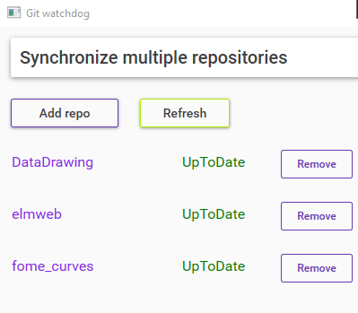
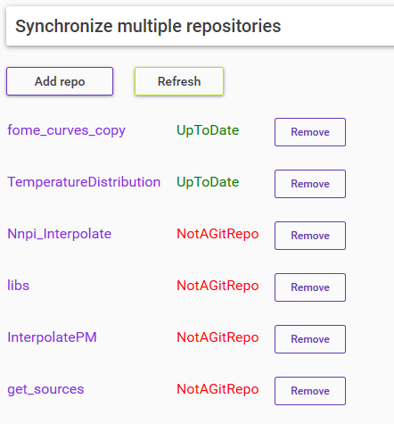

# GitMultiFetch
 
 <!-- PROJECT SHIELDS -->
<!--
*** I'm using markdown "reference style" links for readability.
*** Reference links are enclosed in brackets [ ] instead of parentheses ( ).
*** See the bottom of this document for the declaration of the reference variables
*** for contributors-url, forks-url, etc. This is an optional, concise syntax you may use.
*** https://www.markdownguide.org/basic-syntax/#reference-style-links
-->

[![Forks][forks-shield]][forks-url]
[![Stargazers][stars-shield]][stars-url]
[![Issues][issues-shield]][issues-url]

 

  <h1 align="center">Check status of multiple repositories</h1>
    

    <a href="https://github.com/Altair200333/GitMultiFetch/issues">Report Bug</a>
    <a href="https://github.com/Altair200333/GitMultiFetch/issues">Request Feature</a>
  

<!-- ABOUT THE PROJECT -->
## About The Project

This program shows if repositories are up to date

Just drag & drop foldres into the window

## Examples

<nobr>
 

<!-- MARKDOWN LINKS & IMAGES -->
<!-- https://www.markdownguide.org/basic-syntax/#reference-style-links -->
[contributors-shield]: https://img.shields.io/github/contributors/Altair200333/GitMultiFetch?style=for-the-badge
[contributors-url]: https://github.com/Altair200333/GitMultiFetch/graphs/contributors
[forks-shield]: http://img.shields.io/github/forks/Altair200333/GitMultiFetch?style=for-the-badge
[forks-url]: https://github.com/Altair200333/GitMultiFetch/network/members
[stars-shield]: https://img.shields.io/github/stars/Altair200333/GitMultiFetch?style=for-the-badge
[stars-url]: https://github.com/Altair200333/GitMultiFetch/stargazers
[issues-shield]: https://img.shields.io/github/issues/Altair200333/GitMultiFetch?style=for-the-badge
[issues-url]: https://github.com/Altair200333/GitMultiFetch/issues
[product-screenshot]: images/screenshot.png